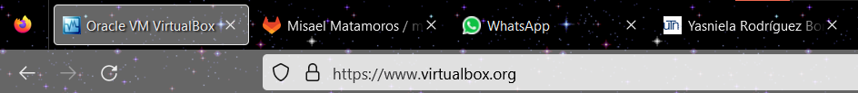
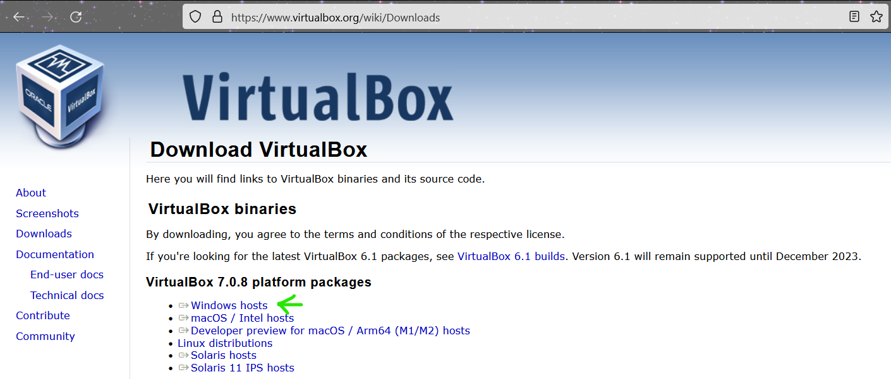
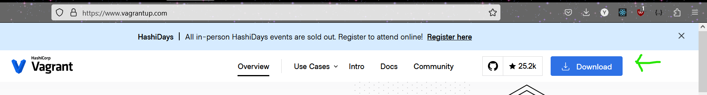
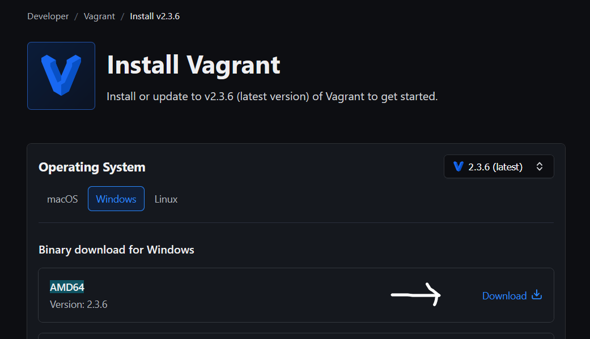
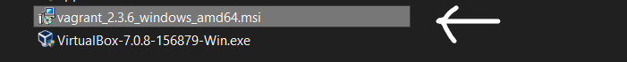
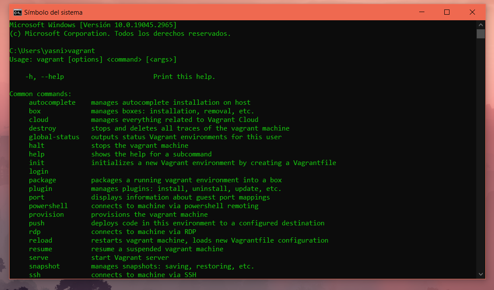
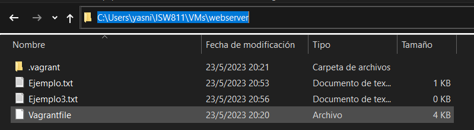
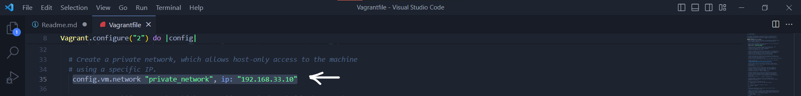
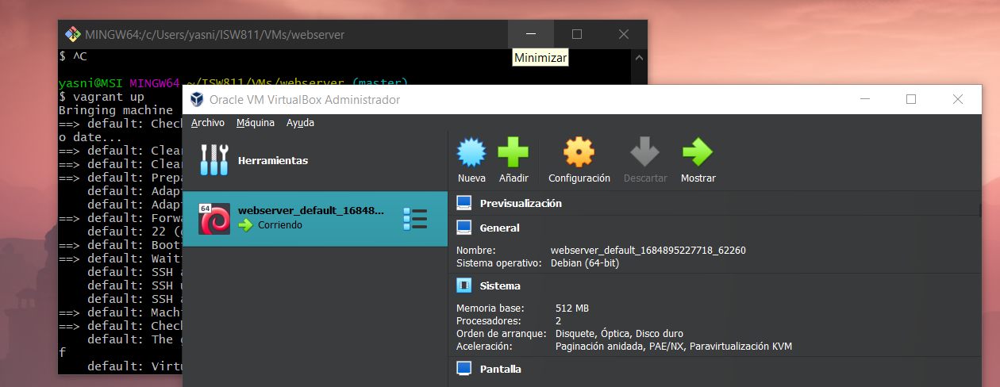

# Workshop 01- Vagrant

## Descarga e instalación de Virtualbox
- Se accede al sitio web oficial en el cual se puede descargar VirtualBox en su navegador favorito: [www.virtualbox.org]( https://www.virtualbox.org)

- Haz click en la opción **Downloads**, en el menú vertical ubicado a la izquierda. Elige la opción de la versión más reciente de VirtualBox compatible con tu sistema operativo. En mi caso es **Windows hosts**.


- Una vez se haya descargado el instalador, ve al explorador de descargas y ejecútalo, siguiendo las instrucciones del asistente de instalación.


- Durante el proceso de instalación de VirtualBox, se le solicitará que se acepten términos de licencia y que se eligan las opciones de instalación predeterminadas. En ese caso se puede dejar las opciones que ya vienen por defecto en caso de que no desees personalizar la instalación. Después de completar la instalación, VirtualBox estará listo para su uso.


## Descarga e instalación de Vagrant
- Se accede al sitio web oficial en el cual se puede descargar Vagrant en su navegador favorito: [www.vagrantup.org]( https://www.vagrantup.com/)


- Haz click en la botón azul de **Download**, en la página principal del sitio web de Vagrant para descargarlo.


- Selecciona la opción de tu sistema operativo y elige la versión de Vagrant que sea compatible con tu computadora y haz click en el link de **_Dowmload_**. En mi caso Windows AMD64, la cual es la opción de 64 bits compatible con mi máquina.


- Una vez se haya descargado el instalador, ve al explorador de descargas y ejecútalo, siguiendo las instrucciones del asistente de instalación.


- Durante el proceso de instalación de Vagrant, se le solicitará que se acepten términos de licencia y que se eligan las opciones de instalación predeterminadas. En ese caso se puede dejar las opciones que ya vienen por defecto en caso de que no desees personalizar la instalación. Después de completar la instalación, Vagrant estará listo para su uso, para comprobar que se haya hecho correctamente ve al cmd y digita vagrant, si proporcionan los comandos los cuales funcionan para utilizar Vagrant quiere decir que se instaló correctamente.



## Aprovisionamiento de la instancia de GNU/Linux Debian Bullseye 64 Bits
- Se debe de crear un carpeta en tu máquina donde se quieras almarcenar los archivos relacionados con la instacia de Vagrant que deseas crear. En mi caso sería: 
```bash
mkdir ISW811
cd ISW811
mkdir VMs
cd VMs
mkdir webserver
cd webserver
```

- Desde tu terminal favorita accede a la carpeta que creaste anteriormete. Como recomedación es preferible que te ubiques en el directorio raiz, para luego copiar la ruta en donde se encuentra la carpeta y acceder fácilmente.
```bash
pwd 
/
cd C:\Users\yasni\ISW811\VMs\webserver
```

- Ejecuta este comando para inicializar un entorno de Vagrant. Este comando creará un archivo **Vagrantfile** en la carpeta.
```bash
vagrant init debian/bullseye64
```


- Abre el archivo **Vagrantfile** con tu editor de texto favorito. Una vez ya esté abierto, busca la línea que comienza con #config.vm.network "private_network", ip: "192.168.33.10" y elimina el símbolo "#" al principio de la línea para descomentarla y seguidamente guarda los cambios.


- Regresa a la terminal y ejecuta el siguiente comando para iniciar la instacia de Vagrant. Esto hara que Vagrant descargue automáticamentela imagen de Debian bullseye 64 bits y la iniciará en una máquina virtual de VirtualBox.
```bash
vagrant up
```


- Luego de que se ejecute y complete el proceso ya se tendrá a disposición la instancia de Debian bullseye 64 bits.

- Para conectarte a la instancia de Debian bullseye 64 bits, ejecuta el siguiente comando: 
```bash
vagrant ssh
```
  Esto te dará acceso a la línea de comandos de la máquina virtual.

- Cuando hayas terminado de utilizar la instancia, utiliza el siguiente comando para apagar la máquina:
```bash
vagrant half
```


