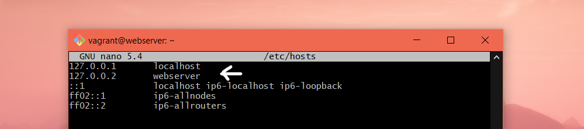
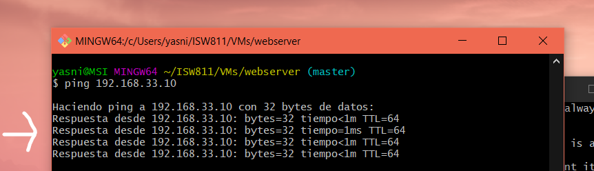

# Workshop 02

## Qué necesitamos para desplegar una aplicacion web?

- Servidor web
- Una base de datos
- Almacenamiento
- Dominio
- Una IP
- Una app (back, front, fullstack)
- Presupuesto
- Seguridad
    - Firewall
- SEO
    - Analítica
## Implementacion de servidor LAMP
A continuación se realizaran una serie de pasos que llevaran a una implementacion exitosa de un servidor LAMP.

1. **Inicializar la máquina.** Lo primero que se debe hacer es asegurarse de haber iniciado la máquina virtual previamente instalada. Es importante que se ubique en la carpeta que contiene el archivo "Vagrantfile" antes de ejecutar el siguiente comando:

   ```bash
   cd ~/ISW811/VMs/webserver
   vagrant up
   ```
   Nota: Si no se encuentra en la ruta especificada, el comando no funcionará y la máquina no se inicializará.

2. **Conectarse por SSH.** Se debe acceder a la máquina Vagrant de tipo GNU/Linux a través de SSH, por esta razón hay que ejecutar el siguiente comando:
   ```bash
   vagrant ssh
   ```
   Nota: Este comando se debe de ejecutar despúes del "Vagrant up".

3. **Cambiar el nombre del host de la máquina virtual para una mejor organización e identificación.** Para utilizar este comando, es necesario estar dentro de la máquina virtual en la cual se desea cambiar el nombre del host predeterminado "bullseye". Esto es beneficioso para tener una mejor organización y facilitar la identificación de la máquina virtual. Para cambiar el nombre del host, se utiliza el siguiente comando:
   ```bash
   sudo hostnamectl set-hostname webserver
   exit
   vagrant ssh
   ```
   Nota: Es importante salirse de la máquina para que se puedan realizar el cambio de nombre correctamente.
   

4. **Actualizar el "hostname" en el archivo host.** Una vez inicializada otra vez la máquina, se debe de terminar de realizar el cambio del "hostname", para ello se debe de actualizar el nombre de la máquina en el archivo "hosts". En la máquina GNU/Linux dicho archivo se encuentra en la ruta _/etc/hosts_ y se puede realizar la edición con nano, con el siguiente comando:
    ```bash
   sudo nano /etc/hosts
   ```
   Nota: Es el segundo host al que se debe de cambiar el nombre, ya que es el host de la red. El host "localhost" por lo general se mantiene con ese nombre, no se le edita.

   

5. **Actualizar la lista de paquetes elegibles.** Antes de que se realice cualquier instalación de paquetes desde los repositorios oficiales, se deben de actualizar la base de datos de paquetes que se encuentran disponibles en la máquina virtual, esto permitirá que antes de instalar se tengan acceso a la información más actualizada. Para ello se utiliza el siguiente comando:
    ```bash
    sudo apt-get update
    ```

6. **Instalación de paquetes.** Una vez actualizada la base de datos de los paquetes, se procede a instalar Vin, curl, Apache2, MySQL y PHP, con el siguiente comando.
    ```bash
    sudo apt-get install vim vim-nox \
    curl git apache2 mariadb-server mariadb-client \
    php7.4 php7.4-bcmath php7.4-curl php7.4-json \
    php7.4-mbstring php7.4-mysql php7.4-xml
    ```

7. **Comprobación de IP del servidor.** Desde la máquina anfitriona de debe de vericar la IP que viene definida en el _Vagrantfile_ en el parametro de <<private_network>> y se procede a hacerle ping con el siguiente comando y en mi caso con la siguiente IP:
    ```bash
    ping 192.168.33.10
    ```
    

8. **Editar el archivo "hosts" en Windows.** En Windows para editar el archivo de "hosts" se deben ejecutar desde un cmd como administrador, la ruta en donde se encuentra ubicado es _c:\Windows\System32\drivers\etc_. Una opcion para realizar los cambios es el siguiente :
    ```bash
    cd \
    cd Windows\System32\drivers\etc
    notepad hosts
    ```

9. **Agregar la entrada en el archivo "hosts."** . En el archivo "hosts" mencionado anteriormente, se ha añadido la siguiente entrada para simular la resolución del dominio esperado. Las demás entradas existentes en el archivo no se modifican.
    ```bash
    192.168.33.10 yasniela.isw811.xyz
    ```
    

10. **Verificar el "_Default site_".** Para comprobar y visualizar el sitio que viene por defecto de Apache se debe de situar en la máquina anfitriona, en mi caso con la siguiente URL _http://yasniela.isw811.xyz_ ,también se puede acceder desde la IP del servidor, en mi caso _192.168.33.10_ o por nombre de dominio.

    

11. **Habilitar módulos para admitir múltiples sitios y https.** Estos módulos son esenciales y útiles para admitir hosts virtuales (múltiples aplicaciones que se ejecutan en el mismo servidor) y certificados SSL (para habilitar el sitio a través de HTTPS en el futuro). Para activar estos módulos, ejecuta el siguiente comando en la máquina virtual:
    ```bash
    sudo a2enmod vhost_alias rewrite ssl
    sudo systemctl restart apache2
    ```
12. **Montar carpetas de sitios, montada en dos ubicaciones.** Esto se hace para mejorar el flujo de trabajo, para ello se va a crear un folder local y este se sincronizará con la ruta _/home/vagrant/sites_ de la máquina virtual. Para ello hay que ir al "Vagrantfile" y agregar la siguiente línea:
    ```bash
    config.vm.synced_folder "sites/", "/home/vagrant/sites",
    owner: "www-data", group: "www-data"
    ```
     
    
13. **Reiniciar la máquina.** Luego se hacer la modificación se debe de reiniciar la máquina para que los cambios ocurran correctamente, con los siguientes comandos:
    ```bash
    exit
    vagrant halt
    vagant up
    vagrant ssh
    ```
14. **Crear el "conf" para el sitio.** Es necesario crear un "archivo.conf" para cada sitio que se desea hospedar en el servidor web. Para ello, se va a crear una carpeta y dentro de ella se creará el primer archivo.conf. Para ello es necesario hacer utilidad de los siguientes comandos:
    ```bash
    cd ISW811/VMs/webserver
    mkdir confs
    cd confs
    touch yasniela.isw811.xyz.conf
    code yasniela.isw811.xyz.conf
    ```
    

    Una vez creado el archivo.conf es necesario agregarle el siguiente contenido, con respecto al sitio _yasniela.isw811.xyz_.
    ```
    <VirtualHost *:80>
        ServerAdmin yasnielar@gmail.com
        ServerName yasniela.isw811.xyz
        DirectoryIndex index.php index.html
        DocumentRoot /home/vagrant/sites/yasniela.isw811.xyz
        <Directory /home/vagrant/sites/yasniela.isw811.xyz>
        DirectoryIndex index.php index.html
        AllowOverride All
        Require all granted
        </Directory>
        ErrorLog ${APACHE_LOG_DIR}/yasniela.isw811.xyz.error.log
        LogLevel warn
        CustomLog ${APACHE_LOG_DIR}/yasniela.isw811.xyz.access.log combined
    </VirtualHost>
    ```
    

15. **Copiar "conf" a "sites-available".** Desde la máquina virtual se va a copiar el archivo.conf a lo que viene siendo la ruta de sitios disponibles de Apache2. Para ello utilizaremos el siguiente comendo:
    ```bash
    sudo cp /vagrant/confs/mizaq.isw811.xyz.conf
    /etc/apache2/sites-available
    ```
16. **Verificación de la configuración.** Cuando se agregue un archivo _.conf_ al directorios en donde se encuentran los sitios disponibles se debe reiniciar Apache. Sin embargo, antes de que eso suceda se debe verificar que los archivos de configuración que se acaban de agregar no hayan introducido un error, porque si esto sucede, no se podría reiniciar Apache, para ello se ejecutaría el siguiente comando:
    ```bash
    sudo apache2ctl -t
    ```
    Nota: Si esto succede exitosamente, les debe de aparecer la siguiente respuesta.
    

17. **Configurar el parámetro "ServerName. "** Si al probar la configuración de Apache obtenemos el error Could not reliably
determine the server's fully qualified domain name, debemos ejecutar el
siguiente comando, para agregar la directiva «SeverName» al archivo de
configuración general de Apache, usando el siguiente comando:
    ```bash
    echo "ServerName webserver" | sudo tee -a
    /etc/apache2/apache2.conf
    ```
18. **Habilitar el nuevo sitio.** Otra vez se comprueba la configuración con "apache2ctl -t" y si ya no se tienen errores se procede a habilitar el sitio con a2ensite, y se reinicia la Apache, con los siguientes comandos:
    ```bash
    sudo apache2ctl -t
    sudo a2ensite yasniela.isw811.xyz.conf
    sudo systemctl restart apache2.service
    ```
19. **Verificar el nuevo sitio.** Por último, se comprueba a visualizar el sitio, para ello desde la máquina anfitriona se accede en mi caso a la siguiente URL: _http://yasniela.isw811.xyz_ o el nombre del dominio que tiene asignado. Ahora ya no se observa el sitio que viene por defecto.

