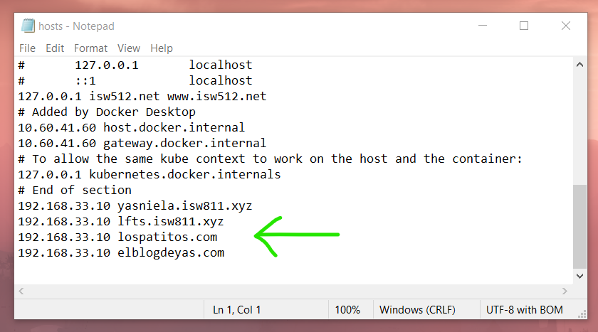
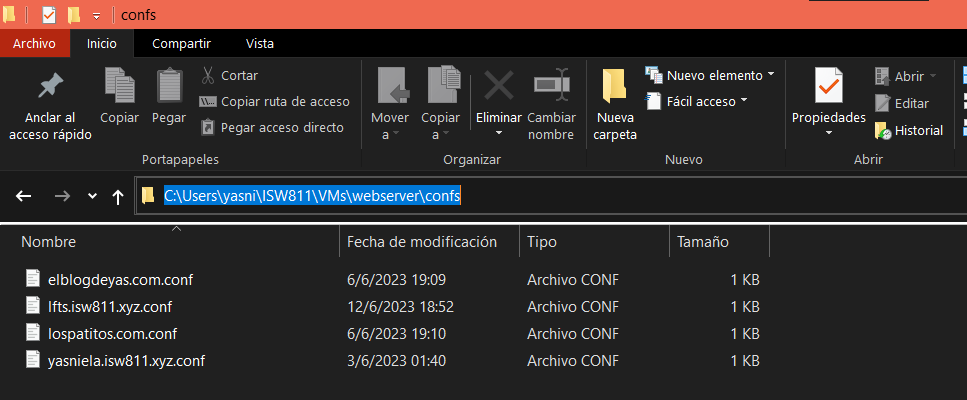
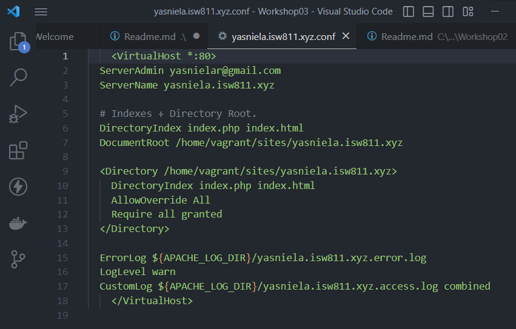
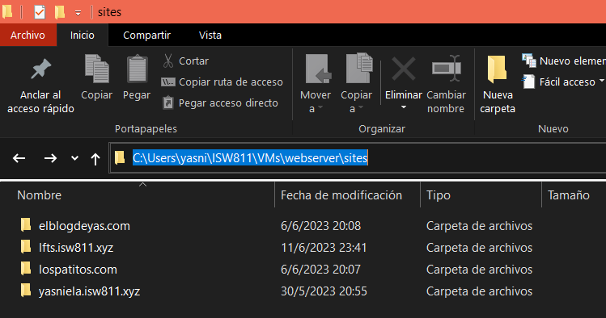
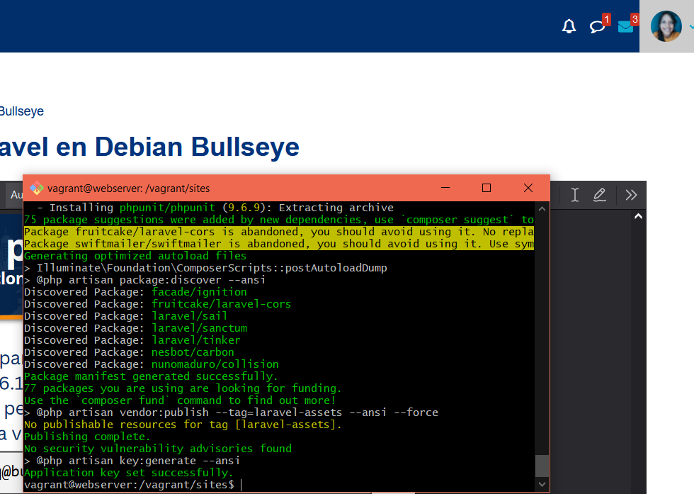
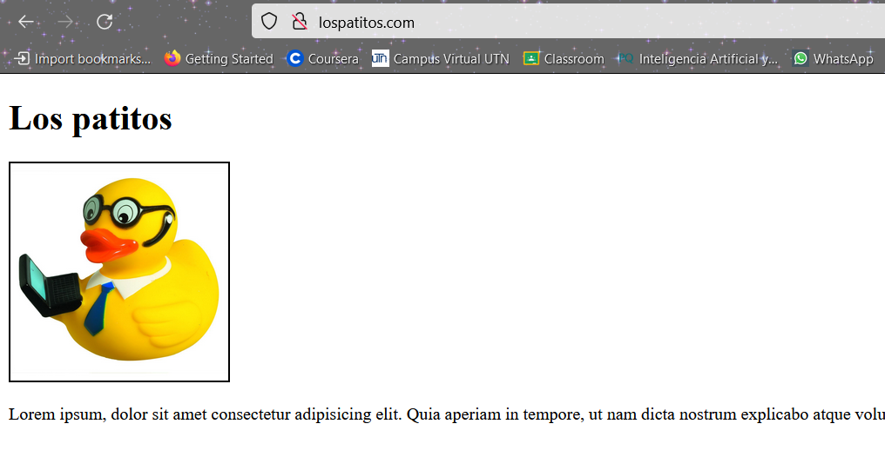
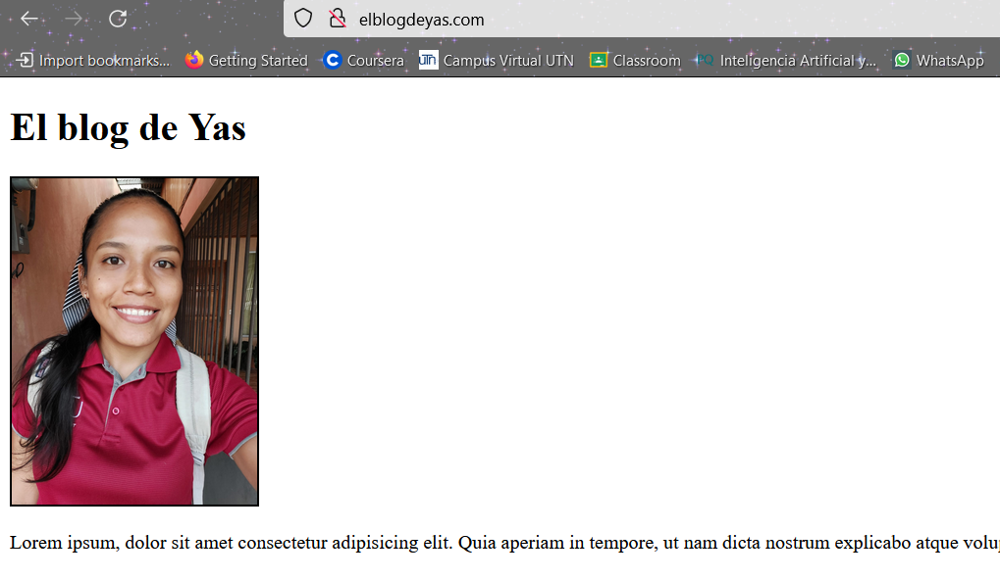
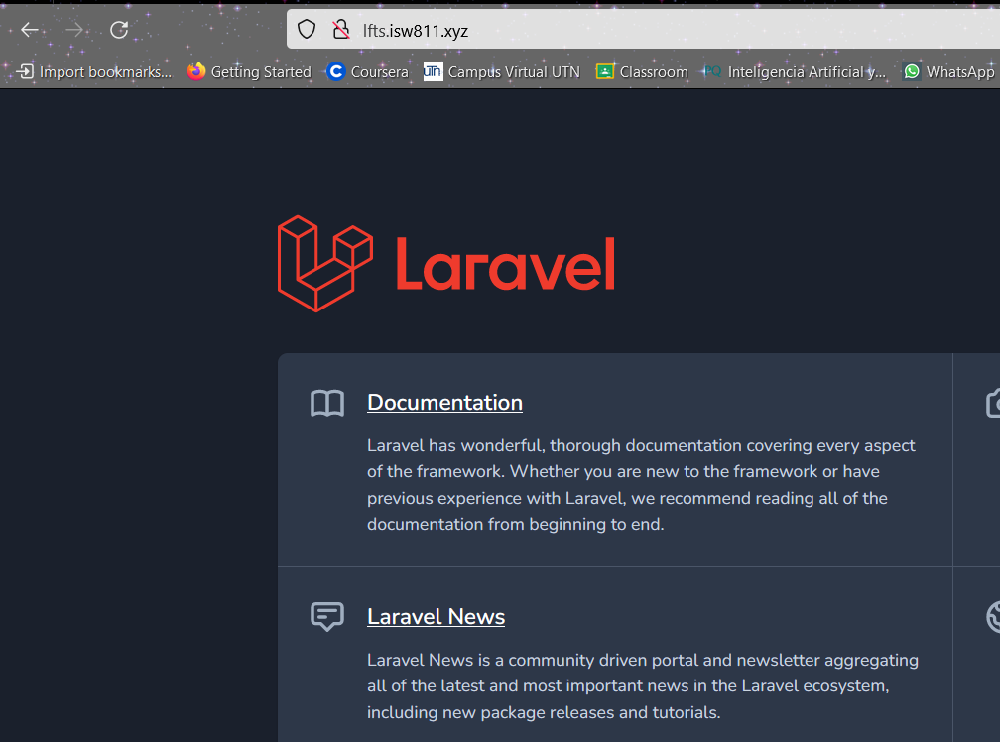
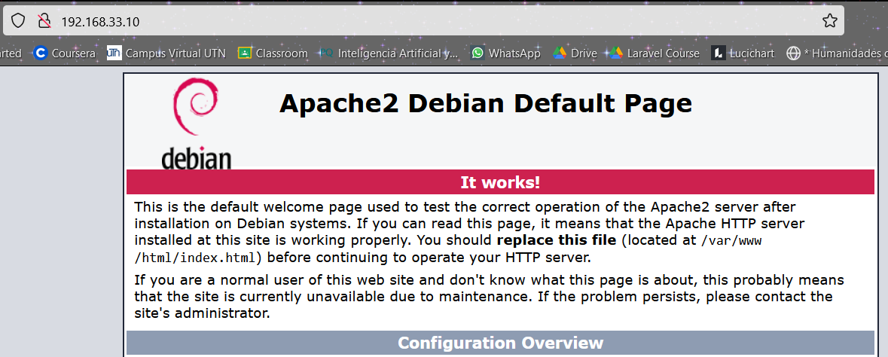

# Workshop 03

## Proxy reverso con Apache2, habilitando varios sitios en el mismo server

A continuación se presentarán una serie de pasos los cuales harán referencia a la impletación del workshop 03.

1. **Inicializar la máquina.** Lo primero que se debe hacer es asegurarse de haber iniciado la máquina virtual previamente instalada. Es importante que se ubique en la carpeta que contiene el archivo "Vagrantfile" antes de ejecutar el siguiente comando:
   ```bash
   cd ~/ISW811/VMs/webserver
   vagrant up
   ```
   Nota: Si no se encuentra en la ruta especificada, el comando no funcionará y la máquina no se inicializará.
2. **Editar el archivo _hosts_ en Windows.** En Windows para editar el archivo de "hosts" se deben ejecutar desde un cmd como administrador, la ruta en donde se encuentra ubicado es _c:\Windows\System32\drivers\etc_. Una opcion para realizar los cambios es el siguiente :
    ```bash
    cd \
    cd Windows\System32\drivers\etc
    notepad hosts
   ```
3. **Agregar la entrada, para resolver los dominios que se desean simular.** En el archivo _hosts_ se agregan las entradas:
    1. _192.168.33.10 lfts.isw811.xyz_
    2. _192.168.33.10 lospatitos.com_
    3. _192.168.33.10 elblogdeyas.com_
    Esto con el fin de simular la resolución de los dominios que deseados, ya entrada que se creó anteriormente no se debe de modificar.

   

   Nota: La ip que se digite en el archivo _hosts_ es la misma que se encuetra en el Vagrantfile de la carpeta webserver.

4. **Crear el _conf_ para cada sitio.** Es necesario crear un archivo _.conf_ para cada sitio que se desea hostedar en el servidor web. Para ello se hará uso de directorio _confs_ para almacenar cada archivo. Desde la máquina anfitriona se digitan los siguientes comandos:
    ```bash
   cd confs
   touch ltfs.isw811.xyz.conf
   touch lospatitos.com.conf
   touch elblogdeyas.com
    ```

    

5. **Editar cada _conf_, el cual se edita desde la máquina antitriona con VSCode.** Para cada contenido _.conf_ se debe de agregar cada contenido, esto irá dependiendo de el nombre de cada archivo, a continuación se le mostrará un ejemplo:

    

6. **Alternativa para crear el _conf_ a partir de una plantilla.** Otra alternativa es copiar un .conf previamente existente y modificar todas
las apariciones del dominio anterior, por el valor correspondiente según el nuevo dominio que desea hospedar. Desde la máquina anfitriona.
    ```bash
   cd confs
   cp yasniela.isw811.xyz.conf elblogdeyas.com.conf
   sed -i -e 's/yasniela.isw811.xyz/elblogdeyas.com/g' \
   elblogdeyas.com.conf
    ```
7. **Crear folders para sitios.** Para tener un orden, se procede a crear un directorio para cada sitio, con el contenido que se desee mostrar, se utilizará los siguientes comandos: 
   ```bash
   cd sites
   mkdir elblogdeyas.com
   mkdir lospatitos.com
   mkdir lfts.isw811.xyz
   touch elblogdeyas.com/index.html
   touch lospatitos.com/index.html
   ```
     

8. **Conectarse por SSH.** Se procede a conectarse por SSH, se debe de tener presente que se debe de estar dentro el directorio webserver, en donde está alojado el _Vagrantfile_, utilizando el siguiente comando:
   ```bash
   cd ~/ISW811/VMs/webserver
   vagrant ssh
   ```
9. **Copiar los _confs_.** Desde la máquina virtual copiamos todos los archivos .conf desde el directorio _/vagrant/confs_ al directorio de sitios disponibles de Apache2 en _/etc/apache2/sites-available_, si esto no se hace, se corre con el riesgo de que no funcione más adelante. Para ello se utilizará los siguientes comandos:
   ```bash
   cd /vagrant/confs
   sudo cp * /etc/apache2/sites-available/
   ```
10. **Habilitar los sitios.** Cuando los archivos _confs_ se hayan copiado exitosamente al directorio _etc/apache2/sites-available_, se procede a habilitar los sitios con el siguiente comando para cada uno:
      ```bash
      sudo a2ensite lospatitos.com.conf
      sudo a2ensite elblogdeyas.com.conf
      sudo a2ensite lfts.isw811.xyz.conf
      ```
11. **Recargar Apache2.** Para que funcione de manera correcta el paso anterior, se debe de reiniciar o recargar la configuración de Apache, esto para que los sitios se habititen y funcione de manera correcta. Antes de reiniciarlo, es una buena práctica revisar que no se haya introducido errores en ninguno de los archivos _.congf_, para ello se utilizará el siguiente comando:
      ```bash
      sudo apache2ctl -t
      sudo systemctl reload apache2
      ```
## Laravel en LAMP server, desplegando el sitio lfts.isw811.xyz

12. **Descargar Composer.** Para utilizar el Framework de laravel son fundamentales estos 2 requisitos:
      1. Instalar en la máquina virtual PHP (Paso completado anteriormente).
      2. Instalar Composer, el cual es el gestor de paquetes de PHP, el cual tambien se debe de hacer dentro de la máquina virtual, para ello utilizaremos la siguiente intrucción:
         ```bash
         php -r "copy('https://getcomposer.org/installer', 'composer-
         setup.php');"
         php composer-setup.php
         rm composer-setup.php
         ```
13. **Instalar Composer.** Luego de descargar y generar el binario de _Composer_, se debe de darle una nueva ubicación y crear un enlace simbólico, esto con el fin de poder invocarlo desde cualquier ubicación y no solo por la que viene por defecto. Para ello se utilizará los siguientes comandos:
      ```bash
      sudo mkdir -p /opt/composer/
      sudo mv composer.phar /opt/composer/
      sudo ln -s /opt/composer/composer.phar /usr/bin/composer
      ```
14. **Crear proyecto, con ayuda de composer se clona la plantilla de Laraver.** Se procede a ubicarse en el directorio en donde tiene alojados los sitios, esto para crear un nuevo proyecto a partir de la plantilla de Laravel en su versión más reciente 8.6.12. Si no se especifíca la versión de Composer, de descargará la más recientes. Sin embargo, para efectos del curso se trabajará con la versión 8.6.12, para ello se utilizará los siguientes comandos:
      ```bash
      cd /vagrant/sites
      rm -r lfts.isw811.xyz
      composer create-project laravel/laravel:8.6.12 lfts.isw811.xyz
      ```
        
15. **Verificación de los sitios.** Para visualizar los sitios desde la máquina anfitriona se visitan las siguientes URL:
      1. _http://lospatitos.com_

          

      2.  _http://elblogdeyas.com_

           

      3. _http://lfts.isw811.xyz_

          

16. **Verificar el _default site_.** A pesar de que ahora el servidor web hospeda cuatro sitios distintos, el sitio por defecto sigue habilitado y se puede visualizar a través de la IP del servidor http://192.168.33.10. Eventualmente deshabilitaremos el sitio por defecto.

 

17. **Apagar la máquina virtual.** Cuando se ha terminado de trabajar con la máquina virtual, debemos salir de la sesión SSH con el comando exit y luego, desde la máquina anfitriona lanzamos el comando vagrant halt.    
      ```bash
      vagrant halt
      ```

&copy; 2023 Yasniela Rodríguez. Todos los derechos reservados.
